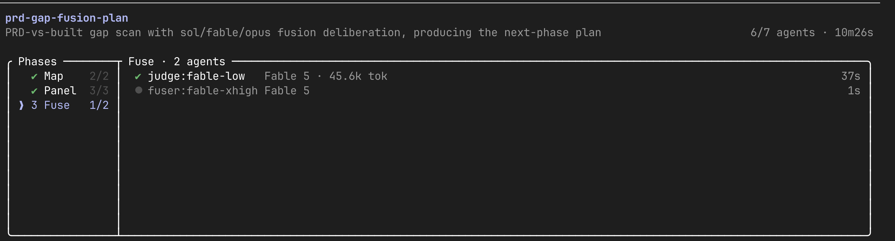
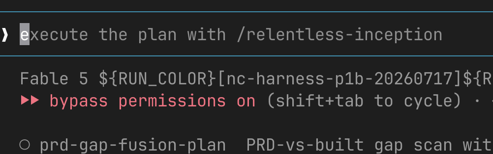

# relentless-inception — Grok Build edition

A long-running autonomous orchestrator **skill for [Grok Build](https://docs.x.ai/build/overview)** (xAI's coding CLI) — plans, builds, adversarially reviews, ships, and resurrects multi-day coding runs without babysitting. Its signature feature is **fusion deliberation gates**: every plan/phase/summarize checkpoint is reviewed by a multi-model panel (Grok + OpenAI + Claude seats) whose reviews are synthesized by a judge + fuser into a structured, provenance-stamped verdict. Fail-closed, always-runs, with a recorded degradation ladder.

> v0.3.0-grok — port of the Claude Code edition ([ahuserious/relentless-inception](https://github.com/ahuserious/relentless-inception)). Seven seat transports; three-vendor default panel (grok-4.5 + gpt-5.6-sol + fable-5, all @xhigh); same gates, same safety rails.



## Prerequisites

1. **Grok Build** (the `grok` CLI):
   ```bash
   curl -fsSL https://x.ai/cli/install.sh | bash      # Windows: irm https://x.ai/cli/install.ps1 | iex
   grok login                                          # SuperGrok or X Premium+ (headless box: grok login --device-auth)
   ```
2. **For the default three-vendor panel** (each piece optional — missing seats degrade per the recorded ladder, and with none of the three the gates still run on the native grok-panel floor):
   - **`XAI_API_KEY`** — x.ai API key (pay-as-you-go) for the direct `api.x.ai` panel-expert seat (grok-4.5 @xhigh).
   - **OpenAI Codex CLI** — `npm i -g @openai/codex`, then `codex login` with your ChatGPT account. Powers the gpt-5.6 seats through your subscription (no API key).
   - **Claude Code CLI** — the `claude` binary, signed in with your Claude subscription. Powers the headless `claude -p` seats (panel, judge, and the default fuser).
3. *(Optional)* `OPENAI_API_KEY` / `ANTHROPIC_API_KEY` / `OPENROUTER_API_KEY` — enable the corresponding provider-direct HTTP transports as alternatives to the subscription CLIs.
4. `jq`, `git`, `docker`, `python3`, `perl`, `curl` on PATH (`scripts/check_prereqs.sh` verifies everything and live-probes your model seats).

## Install

**One-shot installer** (clone + config scaffold + preflight; idempotent, never overwrites your config — the recommended path):

```bash
curl -fsSL https://raw.githubusercontent.com/ahuserious/relentless-inception-grok/main/install.sh | bash
```

**Manual clone** (plain skill directory — `SKILL.md` is at the repo root):

```bash
git clone https://github.com/ahuserious/relentless-inception-grok ~/.grok/skills/relentless-inception-grok

# user config (edit to taste — this copy survives skill upgrades)
mkdir -p ~/.claude/relentless-inception-grok
cp ~/.grok/skills/relentless-inception-grok/assets/fusion.config.default.json \
   ~/.claude/relentless-inception-grok/fusion.config.json

# secrets (only needed for the provider-direct transports)
cp ~/.grok/skills/relentless-inception-grok/assets/secrets.env.example \
   ~/.claude/relentless-inception-grok/secrets.env
chmod 600 ~/.claude/relentless-inception-grok/secrets.env
# then fill in whichever of XAI_API_KEY / OPENAI_API_KEY / ANTHROPIC_API_KEY / OPENROUTER_API_KEY you use

# preflight — probes CLI logins, your panel seats, and the direct-HTTP rungs
~/.grok/skills/relentless-inception-grok/scripts/check_prereqs.sh
```

Grok Build also scans `~/.claude/skills/` zero-config, so `~/.claude/skills/relentless-inception-grok` works as an alternate clone target. Prefer `~/.grok/skills/`: both editions share the frontmatter name `relentless-inception`, and in Grok Build's user tier `~/.grok/skills/` outranks `~/.claude/skills/` — so the Grok edition wins inside Grok Build while Claude Code (which never scans `~/.grok/`) keeps seeing only the Claude edition. The two editions also use separate config namespaces (`~/.claude/relentless-inception-grok/` vs `~/.claude/relentless-inception/`), so they coexist cleanly.

**Plugin path (UNVERIFIED):**

```
grok plugin install ahuserious/relentless-inception-grok --trust
```

This path is **unverified**: this repo's layout is a root-level `SKILL.md`, not a plugin `skills/` subdirectory, and while docs.x.ai states Grok auto-reads Claude Code marketplaces and plugins, the user guide does not document `.claude-plugin/marketplace.json` parsing explicitly. If `grok plugin install` does not surface the skill on your build, use the clone paths above (they always work). The Claude-style `.claude-plugin/` manifests are kept for Claude Code compatibility (`/plugin marketplace add ahuserious/relentless-inception-grok`, then `/plugin install relentless-inception-grok@ahuserious-grok`).

### Session model (before every run)

The default fuser is a **headless `claude-cli` fable-5 seat at xhigh** — it no longer inherits your session model. Your Grok Build session model matters when the claude CLI is absent and the fuser falls back to `grok-session` (the sanctioned fallback, provenance recorded): in that case run the session on your strongest Grok model first, e.g. launch with `grok -m grok-4.5 --effort xhigh` or switch in the TUI with `/model grok-4.5`.

Then invoke from any chat: `/relentless-inception <your multi-day build task>`.

Full setup walkthrough (all transports, session, config, preflight): **[references/setup.md](references/setup.md)**.

## The default panel (three vendors)

| Seat | Model | Transport | Effort | Auth |
|------|-------|-----------|--------|------|
| Panel expert | grok-4.5 | `xai` (direct `api.x.ai`) | xhigh | `XAI_API_KEY` |
| Panel | gpt-5.6-sol | `codex` (codex CLI) | xhigh | ChatGPT subscription |
| Panel | fable-5 | `claude-cli` (headless `claude -p`) | xhigh | Claude subscription |
| Judge | fable-5 | `claude-cli` | low | Claude subscription · fallback: cheap grok seat |
| Fuser | fable-5 | `claude-cli` | xhigh | Claude subscription · fallback: `grok-session` |

The `xai` panel-expert seat is live-verified (2026-07-18): `api.x.ai/v1/chat/completions` is OpenAI-compatible and grok-4.5 accepts `reasoning_effort: "xhigh"`, returning reasoning tokens with prompt caching active.

## Configure your fusion panel

`~/.claude/relentless-inception-grok/fusion.config.json` (shipped default: `assets/fusion.config.default.json`):

```jsonc
{
  "panel": [
    { "transport": "xai",        "model": "grok-4.5", "count": 1, "effort": "xhigh" },
    { "transport": "codex",      "model": "sol",      "count": 1, "effort": "xhigh" },
    { "transport": "claude-cli", "model": "fable-5",  "count": 1, "effort": "xhigh" }
  ],
  "judge": { "transport": "claude-cli", "model": "fable-5", "effort": "low" },
  "fuser": { "transport": "claude-cli", "model": "fable-5", "effort": "xhigh" }
}
```

- **Transports (seven)**: `grok` = native Grok Build sub-agent seats (no key) · `claude-cli` = headless `claude -p` via Claude subscription · `codex` = codex CLI via ChatGPT subscription · `xai` / `openai` / `anthropic` / `openrouter` = provider-direct HTTP (key in `secrets.env`).
- **codex model aliases** the skill resolves: `sol`→`gpt-5.6-sol`, `luna`→`gpt-5.6-luna`, `terra`→`gpt-5.6-terra`; any catalog slug works, **any reasoning effort** `minimal…xhigh` (`ultra` via raw CLI only).
- **xAI slugs**: `grok-4.5` is the default panel expert; other verified slugs (`grok-4.3`, `grok-4.20-0309-reasoning`, `grok-4.20-0309-non-reasoning`, `grok-4.20-multi-agent-0309`, `grok-build-0.1`) are valid config values.
- **Anthropic models**: `fable-5` and `opus-4.8` only (no `-latest` aliases).
- **Fuser** — empirically the lever (~18-pt quality swing); keep it the strongest model you have. The judge barely matters, so a cheap judge is always safe. When the claude CLI is absent the fuser falls back to `grok-session` (the model your Grok Build session is on, as a fresh instance) and the verdict records that provenance.
- **Temperature** applies only to provider-direct HTTP calls (panel 1.0, judge pinned 0). Don't temp-tune reasoning models — OpenAI o-series/gpt-5.x reasoning ignore or reject it, Claude extended thinking requires temp=1, DeepSeek-R1/Gemini thinking manage sampling internally. Temperature is not a diversity mechanism; diversity comes from distinct models and personas.

## Multimodel deliberation

Every gate is a **fusion deliberation**, not a single reviewer: `Map` (assemble the review
bundle) → `Panel` (N diverse panelists review independently) → `Fuse` (a cheap judge structures
the reviews, then a strong fuser writes the verdict). The fuser is the lever — it must preserve
lone-correct minority findings, never vote or average.

The two screenshots below were captured in the **Claude Code edition's** UI — the pipeline
(Map → Panel → Fuse, judge + fuser seats, provenance) is identical in this edition; only the
host chrome differs.

A live gate (`prd-gap-fusion-plan`, `sol/fable/opus` panel):



Mid-run — `Map ✓`, `Panel ✓`, `Fuse` in progress. The Fuse phase shows the two synthesis seats:
`judge:fable-low` (done, 45.6k tok) and `fuser:fable-xhigh` — in this edition those same two
seats run as headless `claude-cli` calls (fable-5 @low judge, fable-5 @xhigh fuser) rather than
inheriting the host session:


Full mental model + how each seat maps to config: **[references/fusion-deliberation.md](references/fusion-deliberation.md)**.

## What's inside

| Path | What |
|------|------|
| `SKILL.md` | Router: modes, team, triple gate, rescue, safety rails (Grok Build edition notes inline) |
| `AGENTS.md` | Thin instruction-file router Grok Build loads natively |
| `references/setup.md` | **Full setup walkthrough**: install paths, session model/effort, all transports, config, preflight |
| `references/fusion-deliberation.md` | The multimodel deliberation explained, with live-run screenshots |
| `references/adversarial-gates.md` | **Normative fusion-gate spec**: roles, provider ladder, per-gate config, verdict schema, amendment protocol |
| `references/rescue-mode.md` | Stall/kill recovery incl. provider-capacity fast path |
| `references/prereqs.md` | Tool / credential / MCP matrix |
| `scripts/check_prereqs.sh` | Preflight: tool checks + live ladder probes → `gate_capability.json` |
| `scripts/adversarial_review.sh` | Gate driver: runs the runnable seats (codex / provider-direct / claude-cli) + judge. Exit **42** = host runs the deferred grok seats + fuser from `$OUT.prefusion.json`; exit **43** = rung-3 grok-panel floor, host runs the whole floor protocol from `$OUT.grok-panel.json` |
| `assets/verdict.schema.json` | Structured verdict with full provenance (`panel`, `judge_model`, `fuser_model`, `inputs_sha256`, ladder position, degradation flags) |
| `assets/fusion.config.default.json` | The shipped default panel config |
| `agents/` | Per-role prompt templates (panelist / judge / fuser roles included) |
| `.claude-plugin/` | `plugin.json` + `marketplace.json` — Claude Code plugin compatibility |
| `install.sh` | One-shot flat-clone installer (into `~/.grok/skills/`) |

## Design provenance

Gate empirics from the TrustedRouter fusion research artifact ([ahuserious/trustedrouter-fusion-artifact](https://github.com/ahuserious/trustedrouter-fusion-artifact)): generative synthesis over voting, preserve lone-correct minority findings, strongest-model fuser, cheap judge. Battle-tested building the neuro-centrifuge trading-research harness, where the panel caught donor-library determinism bugs that both the implementing agent and the orchestrator's own green test run had missed.
