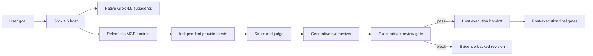

# Architecture

Relentless Inception separates the Grok Build host plane from the enforced fusion plane.

## Host plane

Grok Build owns workspace access, native subagent spawning, permissions, worktrees, implementation, testing, and user approvals. Every bundled native agent explicitly selects `grok-4.5-latest`. Native agents can be assigned different roles and evidence partitions, but Grok Build supports only one child depth; deeper orchestration stays inside the MCP runtime.

The plugin does not silently rewrite user-level Grok model or provider configuration. Native subagents use the host's authenticated model path. A configured Codex CLI role may contribute GPT-5.6 Sol reasoning, but it remains a separate host-controlled seat.

## Fusion plane

The dependency-free Python runtime exposes configuration, diagnostics, fusion, standalone review, status, cancellation, and execution-handoff tools over stdio MCP. It owns:

- validated provider/seat/profile configuration;
- provider-direct and compatible-router dispatch;
- independent-first-pass panel execution;
- anonymous comparative judging;
- fresh minority-preserving synthesis;
- exact-SHA adversarial gates;
- hard call, token, time, tool, and cost budgets;
- retries, circuit breakers, cancellation, and fail-closed degradation;
- atomic private run state and invocation-bound receipts.

External seats never receive Grok's filesystem, terminal, connectors, approval channel, or native subagent tools. Provider-hosted tools execute only in the provider's environment and cannot be cited as local workspace evidence.

## Default model topology

The maximum-intelligence profile uses direct xAI `grok-4.5` for every external panel, judge, synthesizer, and reviewer seat at high effort. Native Grok agents use `grok-4.5-latest`. Optional GPT participation uses exact `gpt-5.6-sol`. There are no weaker automatic fallbacks.

Role diversity among several Grok 4.5 calls is multi-agent deliberation, not cross-model diversity. Cross-model fusion is present only when a separately configured GPT, Claude, routed, or other provider family contributes a bound report.

## Fusion semantics

Panelists answer independently before seeing another report. The judge returns structured lists for consensus, contradictions, partial coverage, unique insights, minority findings, blind spots, and verification priorities. The synthesizer sees the original task and raw reports; it writes a new response rather than selecting by vote. A supported lone-minority finding remains visible until evidence disproves it.

The synthesis is a proposal, not execution authorization. Enabled plan and pre-execution gates must pass before host mutation. Post-execution, final, and summarize gates review one immutable completed-work artifact and byte-identical mechanical evidence.

## Receipt and resume model

Each outbound call is bound to a canonical invocation containing the run, input/config hashes, stage, seat, prompt/system/schema hashes, and reserved attempt. The full normalized response is hashed and linked to one ledger entry and one private raw-response artifact. Resume succeeds only when all links and the semantic cache agree.

These are unkeyed local integrity links, not signatures against a process that can rewrite the entire run directory. Protect the user account and data directory; stronger tamper resistance needs a keyed or external append-only trust anchor.

## Hooks

Stop/SubagentStop hooks can ask Grok to continue when review evidence is missing, but Grok Build intentionally fails open on hook crash, timeout, or malformed output and eventually force-ends repeated continuations. Hooks therefore improve UX only. The MCP runtime refuses an unreviewed or mismatched execution handoff regardless of hook behavior.
