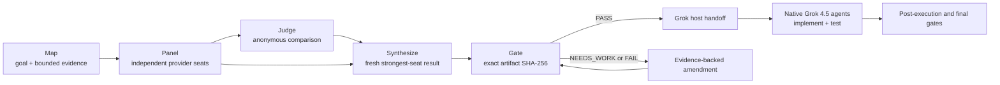

# Fusion Deliberation in Grok Build

Relentless Inception combines Grok Build's native agent and tool plane with a separate, enforced multi-provider fusion plane. Grok owns the workspace. The MCP runtime owns external dispatch, structured comparison, synthesis, exact-artifact gates, budgets, receipts, and resume.

## Pipeline

1. **Map** — the Grok host defines the goal, constraints, smallest sufficient evidence packet, deterministic checks, and any true data partitions.
2. **Panel** — provider seats answer independently before seeing peers. Different personas and context lenses target different error modes.
3. **Judge** — a structured pass identifies agreement, conflict, partial coverage, unique insights, minority findings, blind spots, and next checks. It does not choose a winner or write the final result.
4. **Synthesize** — a fresh seat receives the original task, raw reports, checks, and judge guidance and writes a new artifact. Raw panels remain primary evidence.
5. **Gate** — independent reviewers inspect the exact artifact hash plus byte-identical mechanical evidence. A completed `NEEDS_WORK` or `FAIL` blocks even when a numeric pass quorum might otherwise be met.
6. **Execute** — the runtime emits a hash-bound handoff. Grok completes enabled plan and pre-execution review, then owns permissions, native subagent work, mutations, tests, and the post-execution lifecycle.

## Two planes, two kinds of agents

| Surface | Can access the workspace? | What it does |
|---|---:|---|
| Grok 4.5 host | Yes, under normal Grok permissions | maps work, gathers local evidence, authorizes workflow stages, implements, tests, and reports |
| Bundled native Grok agents | Yes, as host-managed subagents | specialist planning, architecture, implementation, review, test, packaging, graph, background, and rescue roles |
| External provider seats | No | reason only over the bounded packet passed to the MCP tool |
| Provider-hosted tools | No local access | optional web, X search, or code-interpreter work in the provider environment |
| MCP runtime | Only its private plugin/run data | validates configuration, dispatches calls, enforces budgets, persists receipts, and gates handoff |

All 14 bundled native profiles select exact `grok-4.5` at `high`, the strongest effort accepted by tested Grok Build 0.2.106. Installed roles are namespaced, such as `relentless-inception-grok:adversarial-review`. Grok Build currently supports only one native child depth, so deeper panel orchestration stays inside the MCP runtime.

## Maximum-intelligence topology

| Role | Shipped selection | Authority |
|---|---|---|
| Grok host, native agents, execution handoff | exact `grok-4.5`, `high` | Workspace and native tools |
| Required independent panel | three direct-xAI `grok-4.5` seats at `high` with researcher, adversary, and constraint-auditor lenses | Bounded external packet only |
| Comparative judge | direct-xAI `grok-4.5` at `high` | Structured diagnosis only |
| Synthesizer | direct-xAI `grok-4.5` at `high` | Fresh fused artifact; no workspace access |
| Exact-artifact reviewers | direct-xAI `grok-4.5` verifier and constraint-auditor seats | Verdicts over a bound hash |
| Optional cross-family seat | OpenRouter GPT-5.6 Sol by default; direct OpenAI/Anthropic and trusted routers are configurable | Disabled until explicitly configured |

There is no automatic quality downgrade in `maximum_intelligence`. Missing required seats, panel collapse, schema-invalid output, unknown blocking cost, and failed gates stop visibly. Several Grok 4.5 calls provide independent role diversity, not multiple model families. A funded and explicitly enabled GPT, Claude, or other provider family is required for a live cross-model-fusion claim.

## Why synthesis is not voting

The point of an adversarial panel is that one seat may notice the real failure while every other seat misses it. Majority vote can erase exactly that signal. The runtime therefore preserves initial responses, anonymizes model identity for comparison, randomizes report order, prohibits vote/score aggregation, exposes raw panels to synthesis, and carries supported minority evidence forward until it is disproved.

The original TrustedRouter research motivated capable synthesis, bounded panels, and model/persona/evidence diversity rather than temperature as the main decorrelation method. This release intentionally keeps the judge on Grok 4.5 too because the shipped operator preference is smartest-model-only; operators can explicitly configure a different cost/quality tradeoff.

## Reading the lineage screenshots

These captures are from the original Claude Code edition. They show the same user-facing phases, but not the current Grok Build UI, models, or runtime source.

The original host is about to invoke a `prd-gap-fusion-plan` gate:

`Map` and `Panel` have completed while the original judge and fuser are running:

Translate the old labels into the v0.4 Grok Build implementation as follows:

| Original capture | Grok Build runtime equivalent |
|---|---|
| Claude Code session | native Grok 4.5 host |
| Map | host-built task/evidence packet passed to `fuse` |
| Panel | configured independent provider seats, direct Grok 4.5 by default |
| Judge | structured `grok45_judge` response |
| Fuser | fresh `grok45_synthesizer` result |
| downstream gate | `adversarial_gate` over the exact artifact SHA-256 |
| implementation team | plugin-namespaced native Grok 4.5 agents after handoff |

## Gates across the lifecycle

| Stage | Required evidence in the shipped profile |
|---|---|
| Plan | requirements trace and risk analysis |
| Pre-execution | approved fused plan and scope boundaries |
| Post-execution | actual diff, tests, and requirement coverage |
| Final | gate verdict, cost ledger, and provenance |
| Summarize | decisions, open risks, and verification state |

Grok invokes these stages because only the host can collect local evidence. The MCP runtime enforces the reviewer roster, quorum, hash identity, structured verdicts, revision ceiling, receipts, and budget state. Hooks may remind Grok to continue or review, but Grok intentionally fails open when a hook errors; hooks never replace MCP enforcement.

## Receipts, budgets, rescue, and resume

Each outbound call is bound to a canonical invocation, reserved attempt, complete visible response, private raw artifact, and ledger entry. A resumed call is reused only when every link and the semantic cache agree. An HTTP-success response that is empty, malformed, schema-invalid, or otherwise unusable is persisted and accounted before any permitted fallback.

Call, token, reasoning-token, provider-cost, total-cost, tool-call, wall-time, and concurrency limits are hard runtime boundaries. Transport retry, semantic fallback, circuit breaking, adaptive specialist escalation, and human handoff are distinct and bounded. The maximum-intelligence profile forbids degraded single-seat or single-provider completion. A non-empty global or per-run `KILL` file prevents further provider dispatch.

## Configure and validate

Use `/relentless-config show` for the effective configuration, `/relentless-config schema` for the complete settings catalog, and `/relentless-config doctor` before a run. Providers live under `providers`; roles and model ids under `seats`; topology under `profiles.<name>.fusion`; lifecycle review under `profiles.<name>.gates`; cost and stopping policy under `profiles.<name>.budgets` and `profiles.<name>.rescue`; host preferences under `native_grok` and profile execution.

Credentials are environment-variable references only. `provider_models` and `provider_test` are opt-in live checks; OpenRouter native Fusion is intentionally excluded from the cheap probe because it can fan out. Package validation and a healthy MCP process prove discovery, not model quality or live credentials. See [Configuration](CONFIGURATION.md) and [Validation](VALIDATION.md).

## Proven and unproven

The limited-cost campaign proves one seven-call direct-xAI Grok 4.5 fusion/gate path and one corrected native Grok Build agent smoke after a visible cancelled attempt. It does not prove cross-model diversity, OpenRouter acceptance, or Terminal-Bench/DeepSWE performance with Grok as host. See [Release Evidence](RELEASE_EVIDENCE.md) and the immutable [Grok Fusion Artifact](https://github.com/ahuserious/grok-fusion-artifact/tree/limited-cost-2026-07-20).
